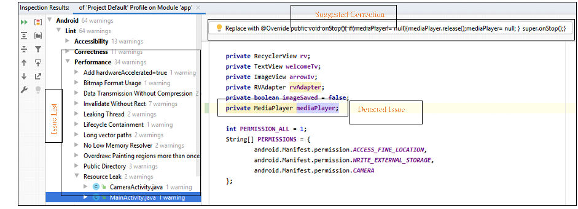
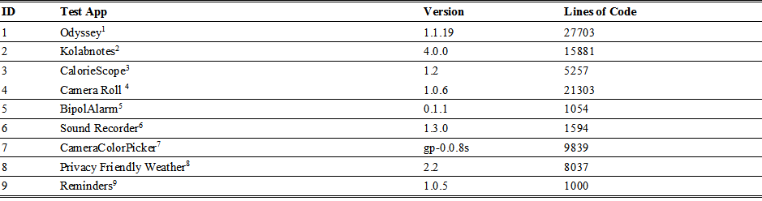
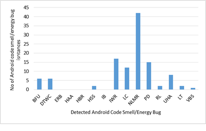
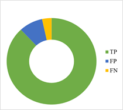
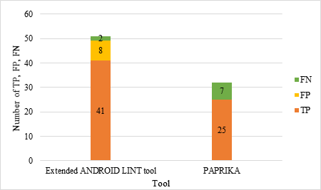

### 1.	Tool usage (extended ‘Android Lint’ tool)

In this section, we explain how to use our extended ‘Android Lint’ tool. The extended ‘Android Lint’ tool is compiled in Jar file. It is not necessary for the user to analyze the complete source code every time a code smell/energy bug needs to be checked. Code smells/energy bugs can also be explicitly checked for any part of source code using the ‘Analyze’ tab of the Android Studio IDE. 
 An application is analyzed for Android code smells and energy bugs in the following steps: 

Step 1: The jar file new extended ‘Android Lint’ tool is placed in the .android/lint folder of the Android Studio installation, typically located in user.home unless specified otherwise. Step 1 is performed one time steps and does not need to be repeated for every analysis
Step 2:  In ‘Analyze’ menu, select ‘Inspect code’ > whole project. The extended ‘Android Lint’ analyzes the source code based on all custom rules and displays a list of detected code smells and energy bugs under Android > Lint > Performance. The custom rules could be differentiated from the default rules using the issue IDs (which are same as the Android code smell/energy bug names defined in Annex A).
Step 3: For each detected code smell/energy bug our extended ‘Android Lint’ tool show Lint warnings to developers. Whenever a new line of code is added and if it violates any rule, it is automatically detected and highlighted by extended ‘Android Lint’ tool.
Step 3: Clicking on the warning sign shows a suggestion for correction, if available (see figure 3). In case of improved code smell/energy bugs the new warning/suggestions are shown below the standard suggestions.
Step 4: Correction can be applied directly on the code by a single click on the suggestion box.

#### 1.1 Example

Typical usage of this tool is explained through the following example:
•	When the user clicks on Analyze > Inspect Code > Whole Project, Android Lint analyzes the source code based on all rules and displays a list of Issues as shown in Figure 5. 
•	Figure 1 also shows refactoring options available to the developer for the energy bug Resource Leak (RL) by highlighting the MediaPlayer instance whose instance has not been released. If the user applies the correction by clicking on this option, the correction is applied in the source code.
•	Figure shows the corrected source code for Resource Leak issue, by releasing MediaPlayer instance.

**Fig. 1.**  (Left) List of detected Issues. (Right) Highlighted source code with defect and correction suggestion

### 2.	Evaluation 

Table 1 shows a list of all the open source application selected from F-Droid for evaluation of our extended ‘Android Lint’ tool. For each application the name of the application, its version and lines of code are shown.
Table 1. List of applications under test

#### 2.1	Evaluation Results

Figure 2 shows the total number of code smell/energy bug instances detected in test applications. Based on these statistics, the most commonly occurring code smells/energy bugs in the applications are No Low Memory Resolver (NLMR), Invalidate without Rect (IWR) and Public Data (PD). Whereas the less occurring code smells/ energy bugs include Immortality Bug (IB), Resource Leak (RL), Leaking Thread (LT) and Vacuous Background Service (VBS). A test on larger data set of test applications can give more insight about the occurrence of these missing code smells in Android applications. An extensive study based on a large dataset of applications would be able to predict trends on how code smells/energy bugs vary across projects, what is their frequency of occurrence, and how does refactoring these code smells/energy bugs impact on energy consumption.  Figure 3 shows the ratio of TP, FP and FN for detected Android code smells and energy bugs. 91% of the total code smells were detected correctly. Whereas, 9% of detected code smells were false positives.  
 
 
Fig. 2. Occurrence of code smell/energy bug per application
 
 
Fig. 3. Chart showing the ratio of TP, FP, and FN for detected Android code smells and energy bugs

Figure 4 shows the occurrence of true positives, false positives and false negatives for the detection results of extended ‘Android Lint’ tool and ‘PAPRIKA’ on five open source Android applications. 

 

Fig 4. Graph showing number of true positives, false positives and false negatives from detection results of extended ‘Android Lint’ tool and ‘PAPRIKA’

### References 

[1]	F. Palomba, D. Di Nucci, A. Panichella, A. Zaidman, and A. De Lucia, “Lightweight detection of Android-specific code smells: The aDoctor project,” Proc. 24th IEEE Int. Conf. Softw. Anal. Evol. Reengineering - SANER, pp. 487–491, 2017, doi: 10.1109/SANER.2017.7884659.
[2]	G. Hecht, R. Rouvoy, N. Moha, and L. Duchien, “Detecting Antipatterns in Android Apps,” in Proc. of the 2nd ACM Int. Conf.on Mobile Softw. Eng. and Sys., MOBILESoft, Sep. 2015, pp. 148–149, doi: 10.1109/MobileSoft.2015.38.
[3]	R. Morales, R. Saborido, F. Khomh, F. Chicano, and G. Antoniol, “EARMO: An Energy-Aware Refactoring Approach for Mobile Apps,” IEEE Trans. Softw. Eng., vol. 44, no. 12, pp. 1176–1206, Dec. 2018, doi: 10.1109/TSE.2017.2757486.
[4]	H. Wu, S. Yang, and A. Rountev, “Static detection of energy defect patterns in Android applications,” in Proceedings of the 25th International Conference on Compiler Construction - CC 2016, 2016, pp. 185–195, doi: 10.1145/2892208.2892218.
[5]	H. Jiang, H. Yang, S. Qin, Z. Su, J. Zhang, and J. Yan, “Detecting Energy Bugs in Android Apps Using Static Analysis,” in Lecture Notes in Computer Science (including subseries Lecture Notes in Artificial Intelligence and Lecture Notes in Bioinformatics), 2017, vol. 10610 LNCS, pp. 192–208, doi: 10.1007/978-3-319-68690-5_12.
[6]	A. Banerjee, L. K. Chong, S. Chattopadhyay, and A. Roychoudhury, “Detecting energy bugs and hotspots in mobile apps,” in Proc. of the 22nd ACM SIGSOFT Int. Symp. on Foundations of Soft. Eng.-FSE, 2014, vol. 16-21-Nove, pp. 588–598, doi: 10.1145/2635868.2635871.

